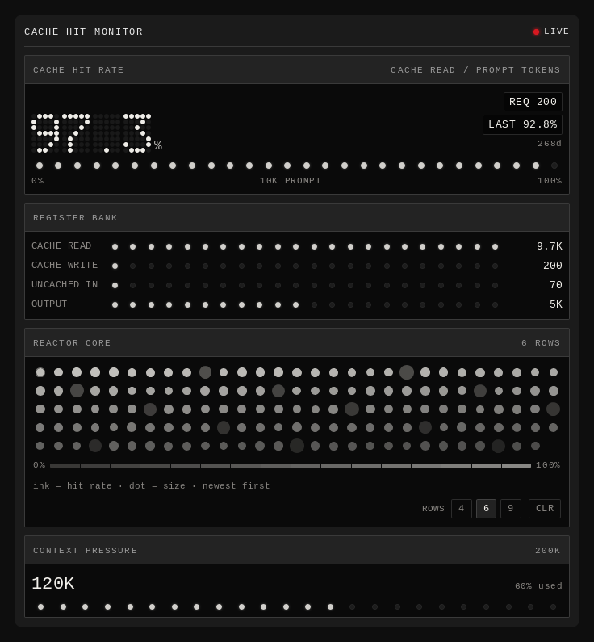

# Cache Hit Monitor

Live prompt-cache telemetry for the current session, drawn as an instrument
panel in the DSH right sidebar.

[](LICENSE)
[](#compatibility)
[](#compatibility)

**English** · [中文说明](README.zh.md)



---

## What it does

The plugin adds one tab to the DSH right sidebar. It reads the `tokenUsage` and
`contextPressure` session projections the Host already publishes and shows them
as four flat instrument faces:

| Face | Shows |
| --- | --- |
| **Hit rate** | Session cache-hit rate as a 5×7 dot-matrix percentage, plus the settled request count, the last request's rate, that request's age and a 28-lamp bar against the current prompt total. |
| **Register bank** | The four disjoint cache buckets — cache read, cache write, uncached input, output — with session totals and proportional lamp rows. |
| **Reactor core** | One cell per settled request, newest first. Ink is that request's cache-hit rate, diameter is its size against the heaviest request on the board, and the field fades with age. |
| **Context pressure** | Pressure tokens against the context window. |

The tab opens by itself once per page load, so the panel is on screen without
hunting through the tab guide. It closes like any other tab.

### How the hit rate is calculated

```
hit rate = cache read / (cache read + cache write + uncached input)
```

Output tokens are deliberately **excluded**. Generated tokens are never
cacheable, so counting them would flatter the number — a long generation would
make a cold prompt look warm.

### The reactor core in detail

One cell is one request that settled while the panel was mounted, ordered
newest-first from the top left. The board is one whole number of rows at all
times, and it is never taller than the history it actually holds, so a young
session shows a short row rather than a large empty lattice.

- **Ink** — the request's hit rate, on a single-hue intensity ramp.
- **Diameter** — `sqrt(request tokens / heaviest request on the board)`, which
  keeps small requests visible next to a cold burst.
- **Fade** — older cells dim toward the bottom of the board.

Each cell carries a `title` with its exact read / write / uncached / output
split, so the picture can be audited rather than trusted.

---

## Install

### From GitHub

```sh
dsh plugin --profile web add github:Billwu18/dsh-cache-hit-monitor
```

Or install it through the Plugin Manager in the Web UI.

### Manual, for development

```sh
git clone https://github.com/Billwu18/dsh-cache-hit-monitor
dsh plugin --profile web add /absolute/path/to/dsh-cache-hit-monitor
```

Then reload the page. The Host re-reads plugin artifacts by modification time,
so edits to `client.js` are picked up by a refresh — no `dsh web` restart.

### Requirements

- DSH `>=0.1.7-rc.1 <0.2.0-0`
- Node `>=20` (only for the test harnesses; the plugin itself runs in the browser)
- React 18 or newer, which the DSH Web UI provides

No dependencies, no build step, no install scripts.

---

## Reading the instrument

- A **filled red dot** next to the title means at least one request has settled
  in this session; an **empty ring** means nothing has been recorded yet.
- The **register bank** shows session totals, not per-request values. Its lamps
  are proportional to the largest bucket on screen.
- The **core legend** (0 % → 100 %) is the ink ramp, so a cell's brightness can
  be read back as a number.
- **ROWS 4 / 6 / 9** sets the maximum board height in rows. The width is chosen
  by the sidebar itself: the panel measures how many columns fit and the board
  grows into whole rows, so the same history fills more rows in a narrow sidebar
  than in a wide one.
- **CLR** clears the recorded history for the current session. It does not touch
  any Host-side data.

---

## How it works

The Host half is deliberately inert (`index.js` exports an empty `apply`). It
exists so the bundle has a Loader row and can be enabled, disabled and inspected
like any other plugin.

Everything the panel shows is already computed on the Host:
[`@deepseek-ai/dsh-token-meter`](https://www.npmjs.com/package/@deepseek-ai/dsh-token-meter)
folds the durable session log into the `tokenUsage` and `contextPressure`
projections. The Client half reads them from its slot props via `useProjection`
and renders.

The client bundle is a single file (`client.js`) in the DSH browser-module
format. It uses only React and standard browser APIs:

- The board measures its own column count from the live layout with
  `getComputedStyle` plus a `ResizeObserver`, and re-renders once before paint.
  If the measurement is unavailable the board simply grows with the data instead
  of being capped.
- The clock for the "age" readout lives in its own component and ticks at the
  resolution it prints (1 s / 5 s / 30 s), so an idle panel is not reconciling
  the whole board once a second.
- Recorded history lives in a bounded module-level cache keyed by session, so it
  survives the remount that a tab switch causes. The tab is also registered with
  `keepMounted: true`, which prevents that remount in the first place.

### Privacy

The panel reads local session projections. It makes no network requests, sends
no telemetry, and stores nothing outside the browser tab. Clearing history
touches only in-memory state.

---

## Compatibility

| | |
| --- | --- |
| DSH | `>=0.1.7-rc.1 <0.2.0-0` |
| Platform | `web` (`dsh.client.platform`) |
| React | 18 or newer (provided by the host) |
| Themes | Both. The instrument faces are intentionally dark in both themes; the surrounding chrome follows the `--dsw-*` theme tokens. |
| Locales | English and Chinese. Other locales fall back to English. |
| Hosts | Any host that provides the `sidebarRightTabs` service. |

---

## Development

No dependencies are required to work on this plugin — the tests run on plain
Node against the real `client.js`.

```sh
node test/run-all.mjs     # all four suites
node test/preview.mjs     # writes HTML that can be screenshotted
```

### Repository layout

```
dsh-cache-hit-monitor/
├── client.js              the entire browser half (React, DSH module format)
├── index.js               the host half (intentionally inert)
├── cordis.patch.yml       the Loader row that installs the plugin
├── package.json           manifest: dsh.bundle + dsh.client
├── icon.svg               plugin card artwork
├── screenshots.json       storefront screenshots, relative to this file
├── locale/
│   ├── en.json            plugin card title and description
│   └── zh.json
├── assets/                screenshots referenced by the READMEs
└── test/
    ├── run-all.mjs        runs every suite below
    ├── preview.mjs        renders the panel to standalone HTML
    ├── wiring.test.mjs    bundle identity, effects, tab and slot registration
    ├── render.test.mjs    the rendered tree: shapes, counts, no NaN, key coverage
    ├── persist.test.mjs   history and depth survive a remount
    └── robust.test.mjs    adversarial inputs and locale coverage
```

### How the tests work

There is no DOM and no test framework. Each harness stubs
`window.__ModuleLoader__` to capture the bundle, stubs `react`, applies the real
`apply(ctx)` against a stub context, then drives the registered component with a
small renderer.

That is enough to assert real behaviour: which services the plugin injects, what
it registers into which slot, how many cells and lamps the tree contains, that
history survives a remount, and that no reachable input produces a thrown
exception or leaks `undefined`/`NaN` into a style string.

| Suite | Asserts |
| --- | --- |
| `wiring` | Module id, declared injects, `ctx.effect` registrations, the tab definition (including `keepMounted`), both keyed slot registrations, and that the body is a component. |
| `render` | Rendered tree shape: dot-matrix dots, reactor cells and cell dots, bar lamps, register rows, exactly one red element, no `undefined`/`NaN` in any style, and that every element in an array has a React key. |
| `persist` | A real per-instance hook runtime: record a request, change the depth, unmount, remount — history, depth and `keepMounted` all confirmed. |
| `robust` | 16 adversarial scenarios (missing or throwing projection, `NaN`/`Infinity`/negative/string token counts, no session id, no translate seat, empty to 10 000 events) must all render, and every locale key must exist in both dictionaries. |

---

## License

[MIT](LICENSE) © 2026 Billwu18
